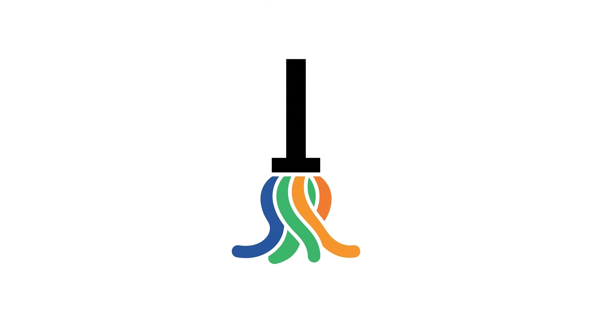
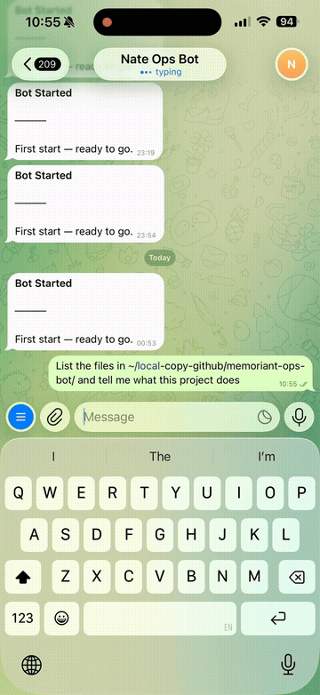

[English](README.md) | [Deutsch](README.de.md) | [Nederlands](README.nl.md) | [Francais](README.fr.md) | [Russkij](README.ru.md) | [Espanol](README.es.md) | [Portugues](README.pt.md)

<p align="center">
  
</p>

<h1 align="center">MOPS</h1>

<p align="center">
  <em>Controle d'agents IA multi-fournisseurs depuis votre telephone.</em>
</p>

<p align="center">
  <a href="#demarrage-rapide">Demarrage rapide</a> &middot;
  <a href="#comment-ca-marche">Comment ca marche</a> &middot;
  <a href="#fonctionnalites">Fonctionnalites</a> &middot;
  <a href="docs/use-cases.md">Cas d'utilisation</a> &middot;
  <a href="docs/installation.md">Guide d'installation</a> &middot;
  <a href="docs/architecture.md">Architecture</a>
</p>

<p align="center">
  
  
  
  
  
  
</p>

---

Lancez Claude Code, OpenAI Codex CLI ou Google Gemini CLI depuis Telegram ou Matrix. Utilise exclusivement les CLIs officiels comme sous-processus -- rien de falsifie, rien de proxifie. Votre abonnement, votre machine, vos donnees.

<p align="center">
  
</p>

> **Publie le 12 mars 2026** -- cinq jours avant qu'Anthropic ne lance [Claude Dispatch](https://mlq.ai/news/anthropic-launches-claude-dispatch-for-remote-desktop-ai-control/). Meme concept, philosophie differente.

### En quoi est-ce different de Claude Dispatch ?


|  | MOPS | Claude Dispatch |
|---|---|---|
| **Fournisseurs** | Claude + Codex + Gemini | Claude uniquement |
| **Cout** | Gratuit -- utilise vos abonnements existants | Forfait Max requis (100+ $/mois) |
| **Controle depuis** | Telegram, Matrix, n'importe quel appareil | Application mobile Claude |
| **Pilote** | N'importe quelle machine -- serveurs, GPU, cloud | Bureau Mac uniquement |
| **Agents paralleles** | Illimites -- sujets, sessions, sous-agents | Conversation unique |
| **Open source** | MIT | Proprietaire |
| **Taches de fond** | Oui, avec delegation + suivis | Oui |
| **Sessions nommees** | Oui | Non |
| **Systeme de plugins** | Oui -- ajoutez Discord, Slack, Signal | Non |

---

## Demarrage rapide

**Etape 1 : Installer Python** (passer si Python 3.11+ est deja installe)

```bash
# macOS
brew install python@3.11

# Ubuntu/Debian
sudo apt update && sudo apt install python3 python3-pip python3-venv

# Windows — telecharger depuis https://www.python.org/downloads/
# ✅ Cocher "Add Python to PATH" pendant l'installation
```

**Etape 2 : Installer pipx** (outil pour les applications Python)

```bash
# macOS
brew install pipx && pipx ensurepath

# Linux
pip install pipx && pipx ensurepath

# Windows
pip install pipx
pipx ensurepath
```

> Apres `pipx ensurepath`, **fermez et rouvrez votre terminal**.

**Etape 3 : Installer MOPS**

```bash
pipx install memoriant-ops-bot
```

**Etape 4 : Installer au moins un CLI IA** (l'agent que MOPS controlera)

```bash
# Choisir un ou plusieurs :
npm install -g @anthropic-ai/claude-code && claude auth     # Claude
npm install -g @openai/codex && codex auth                   # Codex
npm install -g @google/gemini-cli                            # Gemini
```

> Node.js manquant ? Installer d'abord : `brew install node` (macOS) ou `sudo apt install nodejs npm` (Linux) ou telecharger depuis [nodejs.org](https://nodejs.org)

**Etape 5 : Creer un token de bot Telegram** — voir le [Guide Telegram](docs/telegram-setup.md)

**Etape 6 : Lancer MOPS**

```bash
mops
```

L'assistant vous guide a travers la configuration du transport (Telegram ou Matrix), le fuseau horaire, la sandbox Docker optionnelle et l'installation du service.

---

## Comment ca marche

MOPS lance les binaires CLI officiels comme sous-processus et les connecte a votre plateforme de messagerie. Pas de cles API, pas de patches SDK, pas d'en-tetes falsifies. Quand vous envoyez un message sur Telegram, MOPS le transmet au CLI exactement comme si vous l'aviez tape dans votre terminal.

```
Telephone (Telegram/Matrix)
  |
  v
Daemon MOPS (votre machine)
  |
  +---> claude     (sous-processus)
  +---> codex      (sous-processus)
  +---> gemini     (sous-processus)
  |
  v
Reponse diffusee en direct vers le telephone
```

Tout l'etat est stocke dans `~/.mops/` en JSON et Markdown bruts. Pas de base de donnees, pas de services externes.

---

## Modes de chat

MOPS vous offre cinq niveaux d'interaction. Commencez simplement, montez en puissance selon vos besoins.

### 1 &mdash; Chat individuel

Votre conversation 1:1 principale. Chaque message va au CLI actif, les reponses sont diffusees en direct.

```
Vous :  "Explique le flux d'auth dans cette codebase"
Bot :   [diffuse la reponse de Claude Code]

Vous :  /model
Bot :   [bascule vers Codex ou Gemini]
```

### 2 &mdash; Sujets de groupe

Creez un groupe Telegram avec les sujets actives. Chaque sujet obtient son propre contexte CLI isole. Cinq sujets = cinq conversations paralleles, le tout dans un seul groupe.

```
Mes Projets/
  General        -- contexte propre
  Auth           -- contexte propre, modele propre
  Frontend       -- contexte propre
  Base de donnees -- contexte propre
  Refactoring    -- contexte propre
```

### 3 &mdash; Sessions nommees

Lancez une conversation annexe sans perdre votre contexte actuel. Comme ouvrir un second terminal.

```
Vous :  "Travaillons sur l'authentification"
Bot :   [repond sur l'auth]

/session Corriger l'export CSV casse
Bot :   [travaille le CSV dans un contexte separe]

Vous :  "Retour a l'auth -- ajouter la limitation de debit"
Bot :   [reprend exactement la ou vous en etiez]
```

### 4 &mdash; Taches de fond

Deleguez les travaux de longue duree. Vous continuez a discuter, la tache tourne de maniere autonome, les resultats reviennent quand c'est termine.

```
Vous :  "Recherche les 5 principaux concurrents et redige un resume"
Bot :   -> delegue, vous continuez a travailler
Bot :   -> termine, le resume apparait dans votre chat
```

### 5 &mdash; Sous-agents

Deuxieme bot entierement isole -- propre workspace, propre memoire, propre CLI, propre configuration. Tourne sur un autre fournisseur si vous le souhaitez.

```bash
mops agents add codex-agent
```

Vous avez maintenant Claude dans votre chat principal et Codex dans un chat separe, travaillant en parallele avec des contextes independants. Ils peuvent se deleguer mutuellement des taches.

<details>
<summary><strong>Tableau comparatif des modes</strong></summary>
<br>

|  | Individuel | Sujets | Sessions | Taches | Sous-agents |
|---|---|---|---|---|---|
| **Quoi** | 1:1 principal | Un sujet = un chat | Contexte annexe | "Fais ca en arriere-plan" | Bot separe |
| **Contexte** | Un par fournisseur | Un par sujet | Propre par session | Propre, resultat revient | Entierement isole |
| **Workspace** | `~/.mops/` | Partage | Partage | Partage | Propre sous `agents/` |
| **Configuration** | Automatique | Creer groupe + sujets | `/session <prompt>` | Automatique | `mops agents add` |

</details>

---

## Fonctionnalites

**Multi-fournisseurs** &mdash; Basculez entre Claude, Codex et Gemini avec `/model`. Par sujet, par session.

**Multi-transport** &mdash; Telegram et Matrix tournent simultanement. Systeme de plugins pour Discord, Slack, Signal.

**Streaming en temps reel** &mdash; Edition de messages en direct sur Telegram, par segments sur Matrix.

**Memoire persistante** &mdash; Simples fichiers Markdown qui survivent aux sessions et redemarrages.

**Cron & webhooks** &mdash; Planifiez des taches recurrentes avec support des fuseaux horaires. Declencheurs webhook pour les integrations externes.

**Sandbox Docker** &mdash; Conteneur sidecar optionnel avec montages hote configurables pour une execution de code securisee.

**Service d'arriere-plan** &mdash; Installable en tant que systemd (Linux), launchd (macOS) ou Task Scheduler (Windows).

**Synchronisation des skills** &mdash; Skills partagees entre `~/.claude/`, `~/.codex/`, `~/.gemini/`.

**Configuration hot-reload** &mdash; Changez la langue, le modele, les permissions, la scene -- sans redemarrage.

**7 langues** &mdash; English, Deutsch, Nederlands, Francais, Russkij, Espanol, Portugues.

---

## Support des transports

| Plateforme | Statut | Streaming | Interaction | Installation |
|---|---|---|---|---|
| **Telegram** | Principal | Edition de messages en direct | Claviers inline | Integre |
| **Matrix** | Supporte | Par segments | Reactions emoji | `mops install matrix` |

Les deux tournent en parallele sur le meme agent. Ajouter un nouveau messager revient a implementer `BotProtocol` dans un sous-package -- le noyau est entierement agnostique au transport.

---

## Securite

Modele a double liste d'autorisation. Chaque message doit passer les deux verifications :

| Type de chat | Exigence |
|---|---|
| **Prive** | ID utilisateur dans la liste d'autorisation |
| **Groupe** | ID de groupe dans la liste d'autorisation ET ID utilisateur dans la liste d'autorisation |

Les listes d'autorisation sont rechargeable a chaud. Les groupes non autorises declenchent un depart automatique. Tout l'etat est local -- rien ne quitte votre machine.

---

## Commandes

| Commande | Fonction |
|---|---|
| `/model` | Changer de fournisseur/modele |
| `/new` | Reinitialiser la session |
| `/stop` | Arreter les taches en cours + en attente |
| `/session <prompt>` | Demarrer une session nommee |
| `/tasks` | Voir les taches de fond |
| `/cron` | Gerer les taches planifiees |
| `/agents` | Statut multi-agents |
| `/status` | Info session/fournisseur |
| `/diagnose` | Diagnostics runtime |
| `/memory` | Voir la memoire persistante |

<details>
<summary><strong>Commandes CLI</strong></summary>

```bash
mops                    # Demarrer (auto-onboarding)
mops onboarding         # Relancer la configuration
mops stop               # Arreter le bot
mops restart            # Redemarrer
mops upgrade            # Mettre a jour + redemarrer
mops status             # Statut runtime
mops uninstall          # Tout supprimer

mops service install    # Service d'arriere-plan
mops service start|stop|logs

mops docker enable      # Sandbox Docker
mops docker rebuild
mops docker mount /path

mops agents list        # Sous-agents
mops agents add NAME
mops agents remove NAME

mops install matrix     # Transport Matrix
mops install api        # WebSocket API
```

</details>

---

## Espace de travail

```
~/.mops/
  config/config.json          # Configuration
  sessions.json               # Etat du chat
  named_sessions.json         # Sessions nommees
  tasks.json                  # Taches de fond
  cron_jobs.json              # Taches planifiees
  agents.json                 # Registre des sous-agents
  SHAREDMEMORY.md             # Connaissances inter-agents
  workspace/
    memory_system/            # Memoire persistante
    cron_tasks/               # Scripts cron
    skills/ tools/            # Outils partages
    tasks/                    # Dossiers par tache
  agents/<name>/              # Espaces de travail isoles des sous-agents
```

---

## Pourquoi cette approche

D'autres projets patchent des SDKs, falsifient des en-tetes ou proxifient des appels API. C'est fragile et risque de violer les conditions d'utilisation des fournisseurs.

MOPS execute les CLIs officiels comme sous-processus. Rien de plus. Votre abonnement, votre machine, votre authentification. Le bot n'est qu'un pont entre votre telephone et votre terminal.

---

## Documentation

| Guide | Contenu |
|---|---|
| [Installation](docs/installation.md) | Guide d'installation |
| [Vue d'ensemble](docs/system_overview.md) | Runtime de bout en bout |
| [Architecture](docs/architecture.md) | Routage, streaming, callbacks |
| [Configuration](docs/config.md) | Reference complete de configuration |
| [Cas d'utilisation](docs/use-cases.md) | 10 exemples pratiques avec commandes |
| [FAQ](docs/FAQ.md) | Questions fréquemment posées |
| [Dépannage](docs/troubleshooting.md) | Étapes de diagnostic par symptôme |
| [Guide des plugins](docs/plugin-guide.md) | Ajouter des transports & fournisseurs |
| [Configuration Telegram](docs/telegram-setup.md) | Token bot + configuration groupe |
| [Configuration Matrix](docs/matrix-setup.md) | Transport Matrix |
| [Automatisation](docs/automation.md) | Cron, webhooks, heartbeat |
| [Gestion des services](docs/modules/service_management.md) | systemd / launchd / Task Scheduler |

---

## Contribuer

Voir [CONTRIBUTING.md](CONTRIBUTING.md) pour la configuration, les exigences de qualité et les directives de contribution.

```bash
git clone https://github.com/NathanMaine/memoriant-ops-bot.git
cd memoriant-ops-bot
python -m venv .venv && source .venv/bin/activate
pip install -e ".[dev]"
pytest && ruff format . && ruff check . && mypy memoriant_ops_bot
```

---

[Politique de sécurité](SECURITY.md) · [Journal des modifications](CHANGELOG.md)

<p align="center">
  <strong>Licence MIT</strong><br>
  Construit par <a href="https://github.com/NathanMaine">Memoriant Inc.</a>
</p>
